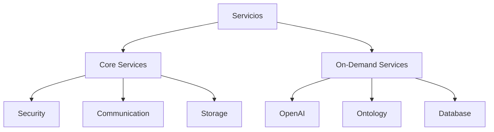

# Arquitectura de Servicios Backend

## 1. Visión General

La arquitectura de servicios está diseñada siguiendo los principios de:
- Lazy Loading (carga bajo demanda)
- Singleton Pattern (instancia única)
- Dependency Injection (inyección de dependencias)
- Service Location (localización de servicios)

### 1.1 Tipos de Servicios



## 2. Estructura Base

### 2.1 LazyLoadService
Base para todos los servicios que implementa funcionalidad común:

```python
class LazyLoadService:
    def __init__(self):
        self._initialized = False
        self._initialization_error = None
        self._socketio = None
    
    @property
    def initialized(self) -> bool:
        return self._initialized
    
    @property
    def socketio(self):
        return self._socketio

    @socketio.setter
    def socketio(self, value):
        self._socketio = value
        if value and hasattr(self, 'register_handlers'):
            self.register_handlers(value)
```

### 2.2 Decorador Lazy Load
Para cargar dependencias bajo demanda:

```python
@lazy_load('service_name')
def my_dependency(self):
    return self._dependency
```

## 3. Servicios Core

Los servicios core son fundamentales y se inicializan al arrancar la aplicación.

### 3.1 Orden de Inicialización

1. **Servicios de Seguridad**:
   - master_key_service
   - encryption_service

2. **Servicios de Comunicación**:
   - websocket_service

3. **Servicios de Datos**:
   - storage_service

### 3.2 Ejemplo de Servicio Core

```python
class StorageService(LazyLoadService):
    _instance = None  # Singleton pattern

    def __new__(cls):
        if cls._instance is None:
            cls._instance = super(StorageService, cls).__new__(cls)
        return cls._instance

    def __init__(self):
        if hasattr(self, '_initialized'):
            return
        super().__init__()
        try:
            self.storage_data = {}
            self._set_initialized(True)
        except Exception as e:
            self._set_initialized(False, str(e))
            raise
```

## 4. Servicios On-Demand

Los servicios on-demand se cargan solo cuando son necesarios.

### 4.1 Características

- Lazy loading de dependencias
- Validación de dependencias antes de cargar
- Registro automático de handlers
- Singleton pattern

### 4.2 Ejemplo de Servicio On-Demand

```python
class OpenAIService(LazyLoadService):
    _instance = None

    def __new__(cls):
        if cls._instance is None:
            cls._instance = super(OpenAIService, cls).__new__(cls)
        return cls._instance

    def __init__(self):
        if hasattr(self, '_initialized'):
            return
        super().__init__()
        try:
            self._storage = None
            self._set_initialized(True)
        except Exception as e:
            self._set_initialized(False, str(e))
            raise

    @property
    @lazy_load('storage')
    def storage(self):
        return self._storage

    def register_handlers(self, socketio):
        if not socketio:
            return
        # Registrar handlers específicos
```

## 5. Service Locator

El ServiceLocator es el componente central que gestiona todos los servicios.

### 5.1 Responsabilidades

- Inicialización de servicios core
- Gestión de servicios on-demand
- Validación de dependencias
- Registro de servicios
- Acceso global a servicios

### 5.2 Implementación

```python
class ServiceLocator:
    def __init__(self):
        self._services = {}
    
    def get(self, name: str):
        # Intentar obtener servicio core
        service = self._services.get(name)
        if service:
            return service
            
        # Si no existe, intentar cargar on-demand
        if name in ['openai', 'ontology', 'database_search']:
            return self.get_on_demand_service(name)
```

## 6. Gestión de WebSocket

### 6.1 Registro de Handlers

Los handlers de WebSocket se registran automáticamente cuando:
1. El servicio recibe una instancia de socketio
2. El servicio implementa el método register_handlers

### 6.2 Ejemplo de Handlers

```python
def register_handlers(self, socketio):
    @socketio.on('my.event')
    def handle_event(data):
        try:
            # Validar datos
            if not isinstance(data, dict):
                raise ValueError("Invalid data format")

            # Procesar evento
            result = self.process_data(data)

            # Emitir respuesta
            socketio.emit('my.response', {
                'status': 'success',
                'data': result
            })
        except Exception as e:
            socketio.emit('my.response', {
                'status': 'error',
                'message': str(e)
            })
```

## 7. Dependencias

### 7.1 Mapa de Dependencias

```python
dependencies = {
    'openai': ['storage', 'encryption', 'websocket'],
    'ontology': ['openai', 'storage'],
    'database_search': ['storage']
}
```

### 7.2 Validación

```python
def validate_dependencies(self, service_name: str) -> bool:
    required = self.dependencies.get(service_name, [])
    return all(self.is_registered(dep) for dep in required)
```

## 8. Implementación de Nuevos Servicios

### 8.1 Servicio Core

1. Heredar de LazyLoadService
2. Implementar patrón singleton
3. Inicializar en ServiceLocator._init_core_services

### 8.2 Servicio On-Demand

1. Heredar de LazyLoadService
2. Implementar patrón singleton
3. Definir dependencias en ServiceLocator
4. Implementar register_handlers si necesita WebSocket

### 8.3 Template

```python
class MyService(LazyLoadService):
    _instance = None

    def __new__(cls):
        if cls._instance is None:
            cls._instance = super(MyService, cls).__new__(cls)
        return cls._instance

    def __init__(self):
        if hasattr(self, '_initialized'):
            return
        super().__init__()
        try:
            # Inicialización
            self._set_initialized(True)
        except Exception as e:
            self._set_initialized(False, str(e))
            raise

    def register_handlers(self, socketio):
        if not socketio:
            return
        # Implementar handlers

# Instancia global
my_service = MyService()
```

## 9. Buenas Prácticas

1. **Singleton**:
   - Usar _instance para instancia única
   - Implementar __new__ sin parámetros
   - Crear instancia global del servicio

2. **Lazy Loading**:
   - Usar decorador @lazy_load para dependencias
   - No cargar servicios innecesariamente
   - Validar dependencias antes de cargar

3. **WebSocket**:
   - Implementar register_handlers si necesario
   - Manejar errores en handlers
   - Usar logging para debug

4. **Logging**:
   - Usar logger específico por servicio
   - Documentar errores y estados
   - Usar emojis para mejor legibilidad

5. **Gestión de Errores**:
   - Capturar y loguear excepciones
   - Establecer estados de error
   - Propagar errores apropiadamente 