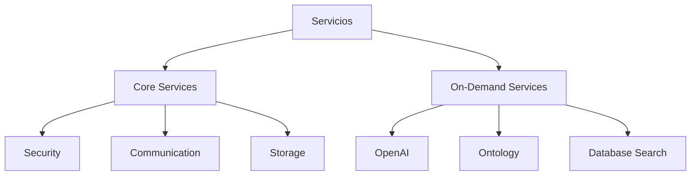

# Arquitectura de Servicios Backend

## 1. Visión General

La arquitectura de servicios está diseñada siguiendo los principios de:
- Lazy Loading (carga bajo demanda)
- Singleton Pattern (instancia única)
- Dependency Injection (inyección de dependencias)
- Service Location (localización de servicios)

### 1.1 Tipos de Servicios



## 2. Estructura Base

### 2.1 LazyLoadService
Base para todos los servicios que implementa funcionalidad común:

```python
class LazyLoadService:
    def __init__(self):
        self._initialized = False
        self._initialization_error = None
        self._socketio = None
    
    @property
    def initialized(self) -> bool:
        return self._initialized
    
    def _set_initialized(self, success: bool, error: Optional[str] = None):
        self._initialized = success
        self._initialization_error = error
```

### 2.2 OnDemandHandlers
Base para todos los handlers de servicios on-demand:

```python
class OnDemandHandlers:
    def __init__(self, socketio, service_name: str):
        self.socketio = socketio
        self.service = service_locator.get(service_name)
        
    def _register_handlers(self):
        raise NotImplementedError()
        
    def _emit_error(self, event: str, message: str, request_id: Optional[str] = None):
        self.socketio.emit(event, {
            'status': 'error',
            'message': message,
            'request_id': request_id
        })
```

## 3. Servicios Core

Los servicios core son fundamentales y se inicializan al arrancar la aplicación.

### 3.1 Orden de Inicialización

1. **Servicios de Seguridad**:
   - master_key_service (gestión de claves maestras)
   - encryption_service (encriptación/desencriptación)

2. **Servicios de Comunicación**:
   - websocket_service (comunicación en tiempo real)

3. **Servicios de Datos**:
   - storage_service (almacenamiento persistente)

## 4. Servicios On-Demand

Los servicios on-demand se cargan solo cuando son necesarios y siguen una estructura común.

### 4.1 Estructura de un Servicio On-Demand

Cada servicio on-demand tiene dos componentes principales:

1. **Service Class**: Hereda de LazyLoadService
```python
class MyService(LazyLoadService):
    _instance = None  # Singleton

    def __init__(self):
        if hasattr(self, '_initialized'):
            return
        super().__init__()
        self._dependencies = None
        self._set_initialized(True)

    @property
    @lazy_load('dependency')
    def dependency(self):
        return self._dependency

    def process_query(self, user_prompt: str, install_id: str, **kwargs):
        # Lógica específica del servicio
        pass
```

2. **Handlers Class**: Hereda de OnDemandHandlers
```python
class MyHandlers(OnDemandHandlers):
    def __init__(self, socketio):
        super().__init__(socketio, 'service_name')
    
    def _register_handlers(self):
        @self.socketio.on('my.event')
        def handle_event(data):
            try:
                # Validar datos
                is_valid, error, request_id = self._validate_data(
                    data, ['required_fields'], 'my.response'
                )
                if not is_valid:
                    self._emit_error('my.response', error, request_id)
                    return

                # Procesar con el servicio
                response = self.service.process_query(
                    user_prompt=data.get('text'),
                    install_id=data.get('install_id')
                )

                # Enviar respuesta
                self.socketio.emit('my.response', {
                    'status': 'success',
                    'response': response,
                    'request_id': request_id
                })
            except Exception as e:
                self._emit_error('my.response', str(e), data.get('request_id'))
```

### 4.2 Servicios Implementados

#### OpenAI Service
- **Propósito**: Procesamiento de lenguaje natural
- **Eventos**: 
  - `openai.test_search` → `openai.test_result`
- **Dependencias**: ['storage', 'encryption']

#### Ontology Service
- **Propósito**: Análisis de términos médicos
- **Eventos**: 
  - `ontology.search` → `ontology.result`
- **Dependencias**: ['openai', 'storage']

#### Database Search Service
- **Propósito**: Búsqueda en base de datos LOINC
- **Eventos**: 
  - `database.search` → `database.result`
- **Dependencias**: ['storage']

## 5. Service Locator

El ServiceLocator es el componente central que gestiona todos los servicios.

### 5.1 Responsabilidades

- Inicialización de servicios core
- Gestión de servicios on-demand
- Validación de dependencias
- Registro de servicios
- Acceso global a servicios

### 5.2 Mapa de Dependencias

```python
dependencies = {
    'openai': ['storage', 'encryption', 'websocket'],
    'ontology': ['openai', 'storage'],
    'database_search': ['storage']
}
```

## 6. Flujo de Comunicación

### 6.1 Flujo Típico

1. Frontend emite evento WebSocket
2. Handler recibe el evento y valida datos
3. Handler llama al servicio correspondiente
4. Servicio procesa la petición usando sus dependencias
5. Handler emite respuesta al frontend

### 6.2 Manejo de Errores

1. Validación de datos
2. Verificación de dependencias
3. Control de excepciones
4. Respuestas estandarizadas

```python
{
    'status': 'error',
    'message': str(error),
    'request_id': request_id
}
```

## 7. Logging

### 7.1 Niveles de Log

- **DEBUG**: Información detallada (desarrollo)
- **INFO**: Eventos normales
- **ERROR**: Errores recuperables
- **CRITICAL**: Errores fatales

### 7.2 Formato

```python
logger.info("=" * 50)  # Separador
logger.info("📨 Evento recibido")
logger.info("📝 Datos: ...")
logger.info("=" * 50)  # Separador
``` 